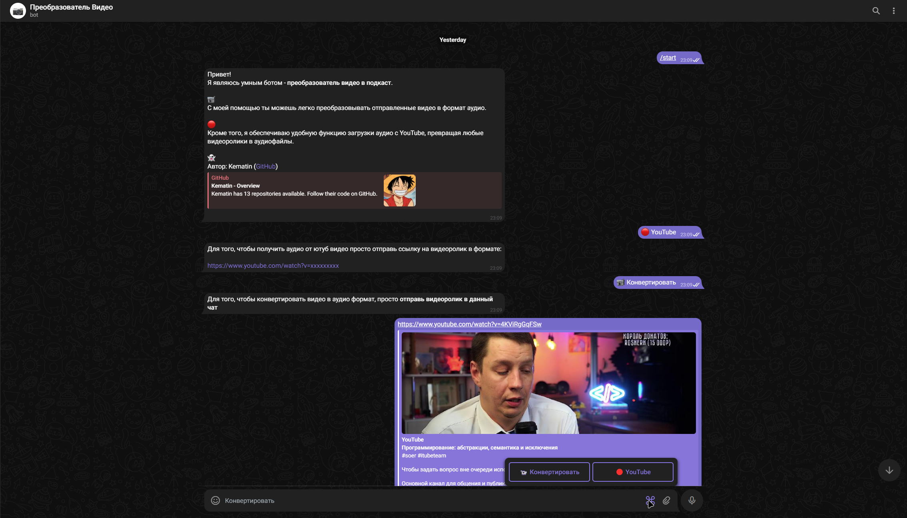
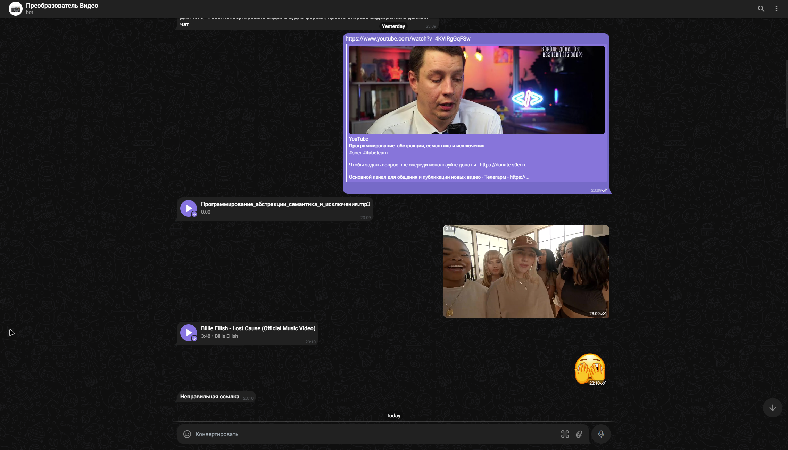

# Конвертор видео бот

Телеграмм бот для преобразования видео в аудио.

Bot URL - https://web.telegram.org/a/#6599542453




**Основные функции**:
1. Преобразование ролика из ютуб в аудио дорожку
2. Преобразование видео пользователя в аудио дорожку

**Стек**:
- python 3.10
- aiogram (Бот)
- telethon ([Обход ограничений.](https://github.com/aiogram/aiogram/discussions/557))
- pytube (Для ютуб)
- ffmpeg (Для видео)

**Build**:
Для корректной работы так-же установите
[ffmpeg](https://www.ffmpeg.org/download.html). Добавьте ffmpeg в PATH, если установили программму не глобально.
```bash
# clone repo
git clone https://github.com/Kematin/Telegram-Bots.git
cd ConvertVideoToAudio/

# activate venv
python3.10 -m venv venv
. /venv/bin/activate

# install deps
pip install -r requirements.txt

# launch
python bot.py
```

**Переменные окружения (.env)**:
[BOT](https://web.telegram.org/a/#93372553), [API](https://my.telegram.org/)
```bash
BOT_TOKEN="YOUR BOT TOKEN"
API_ID="YOUR ACCOUNT ID"
API_HASH="YOUR ACCOUNT HASH"
```

**Docker**:
```bash
docker build -t converter-bot .
docker-compose up -d
```
